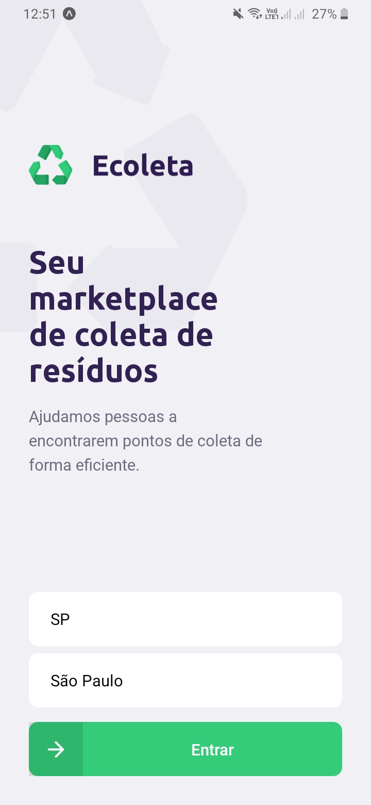
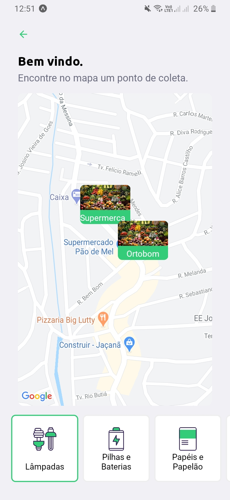
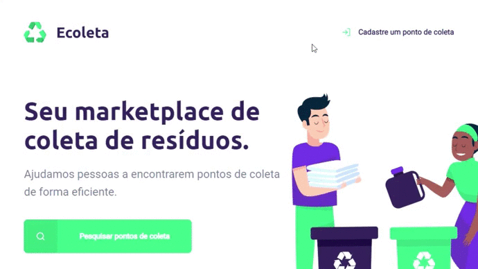

<h1 align=center>

</h1>

<h3 align="center">

Ecoleta é um projeto desenvolvido na semana **Next Level Week (1.0)** da **[Rocketseat](https://rocketseat.com.br/)** utilizando as tecnologias ***TypeScript, Node, React e React Native***.

</h3>

  
Mobile

  
    

## **Objetivo**
Conectar empresas de coleta de resíduos com pessoas que precisam descarta-los, um mapa mostra onde tem locais de coleta para as pessoas.  

## **Tecnologias**
**Web**
  * **[React Router Dom](https://github.com/ReactTraining/react-router/tree/master/packages/react-router-dom)**
  * **[React Icons](https://react-icons.github.io/react-icons/)**
  * **[Axios](https://github.com/axios/axios)**
  * **[Leaflet](https://react-leaflet.js.org/en/)**
  * **[React Leaflet](https://react-leaflet.js.org/)**
  * **[React Dropzone](https://github.com/react-dropzone/react-dropzone)**
  
  **Mobile**
  * **[Expo](https://expo.io/)**
  * **[Expo Google Fonts](https://github.com/expo/google-fonts)**
  * **[React Navigation](https://reactnavigation.org/)**
  * **[Expo Constants](https://docs.expo.io/versions/latest/sdk/constants/)**
  * **[Axios](https://github.com/axios/axios)**
